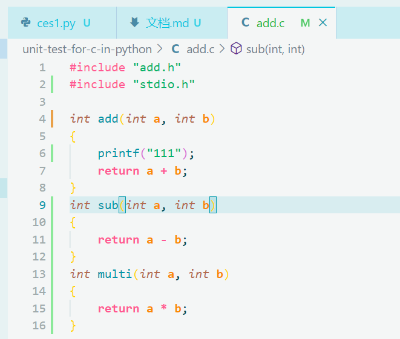
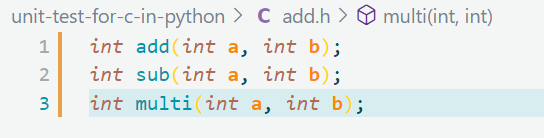
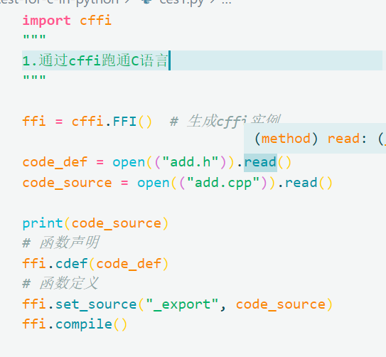
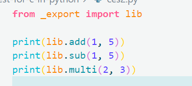
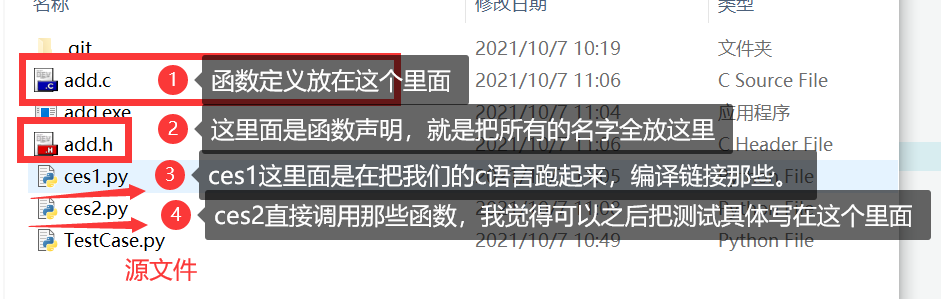

# unittest-for-c
使用pyunit test测试C语言

## docs

### add.c

我们把所有函数的定义写在add.c文件中，这个具体是写每个函数干了些什么。我刚刚试了一下cout，大概可能用不起？

### add.h

把所有函数的声明写在add.h中，就只有个函数名哇。

### ces1.py

这个地方我们就是通过那个cffi库把C语言跑通，这里我已经直接去读文件了，应该不用改了。这里我们们跑了之后会生成一个_export这个模块，下一步需要从这个模块里面去调用我们的函数。

### ces2.py

我们如果ces1跑通了之后，就可以直接去调用我们add.h中的函数了，这里就可以直接去调了，我觉得之后可以把测试的部分放在这里。

